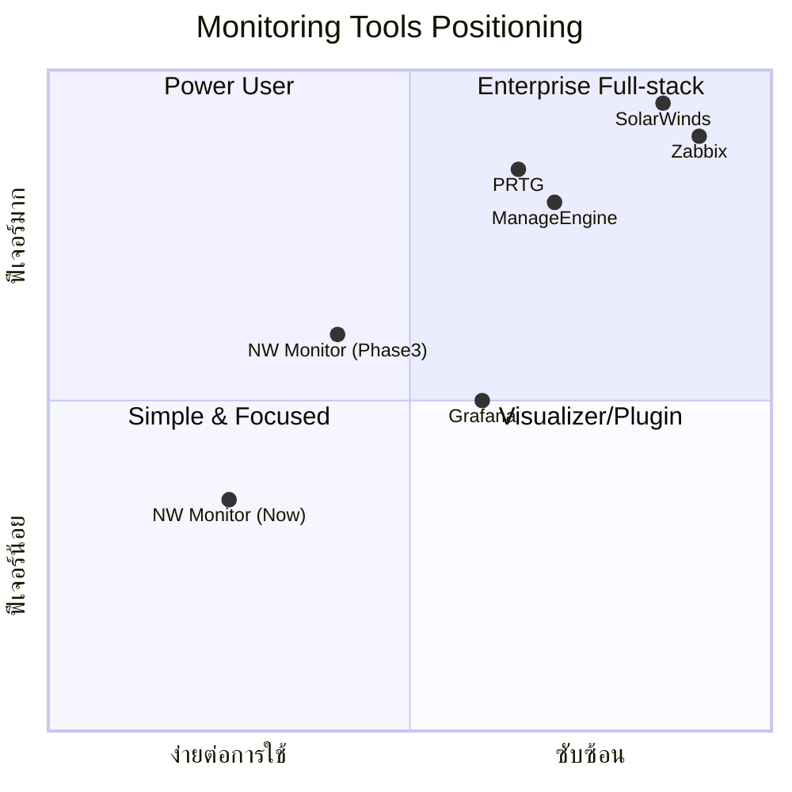

# NW MonitorV0 — Enterprise Gap Analysis
## เปรียบเทียบกับ SolarWinds / PRTG / ManageEngine / Zabbix / Grafana

---

## 1. สรุปความสามารถปัจจุบัน (Current State)

| หมวด | สิ่งที่มีแล้ว |
|------|---------------|
| **Monitoring Protocols** | ICMP Ping, HTTP/HTTPS, SNMP v1/v2c, TCP Port, DNS, SSL Certificate |
| **Alerting** | Email (SMTP), Telegram Bot, LINE Notify (deprecated) |
| **Dashboard** | Custom drag-and-drop builder, widget-based, real-time via WebSocket |
| **Topology** | Interactive vis.js network map + Sub-topology builder |
| **SLA** | Uptime % calculation, SLA target comparison (30 day) |
| **Reporting** | Daily scheduled email reports (HTML) |
| **User Management** | RBAC — Admin / Operator / Viewer |
| **Maintenance** | Maintenance windows (one-time & recurring) |
| **Data Management** | CSV import/export, 30-day retention |
| **Chatbot** | Telegram interactive bot (status, devices, alerts) |
| **Database** | SQLite (single-file) |
| **Backend** | Flask + Flask-SocketIO (Python) |

> [!NOTE]
> แอปมีพื้นฐานที่ดีมากสำหรับโปรเจกต์ single-instance มีฟีเจอร์ครบสำหรับ SME ขนาดเล็ก-กลาง

---

## 2. Feature Gap Matrix — เทียบกับเจ้าตลาด

ตารางด้านล่างแสดงฟีเจอร์ที่เจ้าตลาดมี vs. สถานะของ NW MonitorV0

| ฟีเจอร์ | SolarWinds | PRTG | Zabbix | ManageEngine | Grafana | NW MonitorV0 | ระดับ Gap |
|---------|:---:|:---:|:---:|:---:|:---:|:---:|:---:|
| **ICMP/Ping** | ✅ | ✅ | ✅ | ✅ | via plugin | ✅ | ✔ มีแล้ว |
| **HTTP/HTTPS** | ✅ | ✅ | ✅ | ✅ | via plugin | ✅ | ✔ มีแล้ว |
| **SNMP v1/v2c** | ✅ | ✅ | ✅ | ✅ | — | ✅ | ✔ มีแล้ว |
| **SNMP v3** | ✅ | ✅ | ✅ | ✅ | — | ❌ | 🟡 Medium |
| **SNMP Traps** | ✅ | ✅ | ✅ | ✅ | — | ❌ | 🟡 Medium |
| **TCP Port** | ✅ | ✅ | ✅ | ✅ | — | ✅ | ✔ มีแล้ว |
| **DNS** | ✅ | ✅ | ✅ | ✅ | — | ✅ | ✔ มีแล้ว |
| **SSL Certificate** | ✅ | ✅ | ✅ | ✅ | — | ✅ | ✔ มีแล้ว |
| **WMI/SSH Agent** | ✅ | ✅ | ✅ (agent) | ✅ | — | ❌ | 🔴 High |
| **Bandwidth/NetFlow** | ✅ | ✅ | ✅ | ✅ | via plugin | ❌ | 🔴 High |
| **Syslog Receiver** | ✅ | ✅ | ✅ | ✅ | via Loki | ❌ | 🟡 Medium |
| **Custom Dashboards** | ✅ | ✅ | ✅ | ✅ | ✅ | ✅ | ✔ มีแล้ว |
| **Template/Auto-discovery** | ✅ | ✅ | ✅ | ✅ | — | ❌ | 🔴 High |
| **Maps/Topology** | ✅ | ✅ | ✅ | ✅ | — | ✅ | ✔ มีแล้ว |
| **Alerting: Multi-channel** | ✅ | ✅ | ✅ | ✅ | ✅ | ✅ | ✔ มีแล้ว |
| **Alert Escalation** | ✅ | ✅ | ✅ | ✅ | ✅ | ❌ | 🟡 Medium |
| **SLA Reporting** | ✅ | ✅ | ✅ | ✅ | — | ✅ (basic) | 🟡ต้องพัฒนา |
| **RBAC** | ✅ | ✅ | ✅ | ✅ | ✅ | ✅ | ✔ มีแล้ว |
| **API (REST)** | ✅ | ✅ | ✅ | ✅ | ✅ | ✅ (internal) | 🟡 ขาด docs |
| **High Availability** | ✅ | ✅ | ✅ | ✅ | ✅ | ❌ | 🔴 High |
| **Scalable Database** | ✅ | ✅ | ✅ | ✅ | ✅ | ❌ (SQLite) | 🔴 High |
| **Distributed Monitoring** | ✅ | ✅ | ✅ (Proxy) | ✅ | — | ❌ | 🔴 High |
| **Event Correlation** | ✅ | ✅ | ✅ | ✅ | — | ❌ | 🟡 Medium |
| **Configuration Backup** | ✅ | — | — | ✅ | — | ❌ | 🟡 Medium |
| **Performance Graphing** | ✅ | ✅ | ✅ | ✅ | ✅ | ✅ (basic) | 🟡 ต้องพัฒนา |
| **Webhook/Integration** | ✅ | ✅ | ✅ | ✅ | ✅ | ❌ | 🟡 Medium |
| **LDAP/SSO Auth** | ✅ | ✅ | ✅ | ✅ | ✅ | ❌ | 🟡 Medium |
| **Mobile App** | ✅ | ✅ | — | ✅ | ✅ | ❌ | 🟡 Medium |
| **Plugin/Extension System** | ✅ | ✅ | ✅ | ✅ | ✅ | ❌ | 🟡 Medium |

---

## 3. แผนพัฒนาแบ่งเป็น Phase

### 🏗️ Phase 1 — Foundation & Scalability (ความสำคัญสูงสุด)

เหตุผล: SQLite + single-process เป็นจุดอ่อนที่สุด ต้องแก้ก่อนจึงจะ scale ได้

| งาน | รายละเอียด | ความยาก |
|-----|-----------|---------|
| **1.1 ย้ายจาก SQLite → PostgreSQL/MySQL** | รองรับ concurrent connections, replication, และ time-series data ที่มากขึ้น | Hard |
| **1.2 แยก Backend เป็น modular architecture** | แยก monitor, alerter, API ออกเป็น microservices หรืออย่างน้อย modular workers | Hard |
| **1.3 Task Queue (Celery/RQ)** | แทน BackgroundScheduler ด้วย distributed task queue | Medium |
| **1.4 Production WSGI/ASGI** | Deploy ด้วย Gunicorn/uWSGI + Nginx แทน Flask dev server | Medium |
| **1.5 Auto Device Discovery** | SNMP walk / ARP scan เพื่อค้นหาอุปกรณ์ในเครือข่ายอัตโนมัติ | Medium |

---

### 📊 Phase 2 — Monitoring Depth (ขยาย Protocol & Metrics)

| งาน | รายละเอียด | ความยาก |
|-----|-----------|---------|
| **2.1 SNMP v3 Support** | รองรับ authentication (SHA/MD5) + encryption (AES/DES) | Medium |
| **2.2 SNMP Traps Receiver** | Listen SNMP traps จากอุปกรณ์ (port 162) | Medium |
| **2.3 Bandwidth/NetFlow/sFlow** | เก็บข้อมูล traffic flow แบบ real-time | Hard |
| **2.4 SSH/WMI Agent-based Monitoring** | เก็บ CPU, RAM, Disk, Process จาก server | Hard |
| **2.5 Syslog Receiver** | รับ syslog จากอุปกรณ์ เก็บและแสดงผล | Medium |
| **2.6 Custom SNMP OID Monitoring** | ให้ user กำหนด OID เองสำหรับ monitor ค่าเฉพาะ | Easy |

---

### 🔔 Phase 3 — Alerting & Intelligence

| งาน | รายละเอียด | ความยาก |
|-----|-----------|---------|
| **3.1 Alert Escalation** | ถ้า alert level 1 ไม่ตอบใน X นาที → escalate ไป level 2 | Medium |
| **3.2 Alert Dependencies** | ถ้า Core Switch down → suppress alert ของอุปกรณ์ downstream | Medium |
| **3.3 Webhook Integration** | ส่ง alert ไป Slack, Microsoft Teams, PagerDuty, custom webhook | Easy |
| **3.4 Event Correlation** | จับกลุ่ม events ที่เกี่ยวข้อง เช่น เน็ตล่มหลายจุดพร้อมกัน | Hard |
| **3.5 Anomaly Detection** | ใช้ baseline เตือนเมื่อค่าผิดปกติ (response time สูงผิดปกติ) | Hard |

---

### 📈 Phase 4 — Visualization & Reporting

| งาน | รายละเอียด | ความยาก |
|-----|-----------|---------|
| **4.1 Enhanced Charting** | Time-series graphs (ala Grafana) — zoom, drill-down, overlay metrics | Medium |
| **4.2 แผนที่ GIS** | วาง device บน Google Maps / OpenStreetMap | Medium |
| **4.3 PDF/Excel Reports** | ส่งออก SLA report, performance report เป็น PDF/Excel | Medium |
| **4.4 Custom Report Builder** | สร้าง report template เอง, schedule ส่งอัตโนมัติ | Medium |
| **4.5 Dashboard Variables/Templates** | ตัวแปรที่ filter dashboard ตาม site, device type ฯลฯ | Medium |

---

### 🔐 Phase 5 — Enterprise Security & Integration

| งาน | รายละเอียด | ความยาก |
|-----|-----------|---------|
| **5.1 LDAP/Active Directory Auth** | ใช้ user/group จาก AD สำหรับ authentication | Medium |
| **5.2 SSO (SAML/OAuth2)** | Single Sign-On สำหรับองค์กรขนาดใหญ่ | Hard |
| **5.3 Audit Log** | บันทึกทุก action ที่ user ทำ (who/what/when) | Easy |
| **5.4 API Documentation (Swagger)** | เปิด public REST API พร้อม docs | Easy |
| **5.5 Plugin System** | ให้ user เขียน custom monitor/alerter ได้เอง | Hard |

---

### 📱 Phase 6 — Accessibility & UX

| งาน | รายละเอียด | ความยาก |
|-----|-----------|---------|
| **6.1 Progressive Web App (PWA)** | ใช้งานผ่านมือถือเหมือน native app | Medium |
| **6.2 Dark/Light Theme Switcher** | UI themes ที่สวยงาม | Easy |
| **6.3 Internationalization (i18n)** | รองรับหลายภาษา (ไทย/อังกฤษ) | Medium |
| **6.4 Responsive Mobile UI** | ปรับ layout ให้ใช้งานบนมือถือได้ดี | Medium |

---

## 4. สรุปจุดแข็ง vs จุดอ่อน

### ✅ จุดแข็งที่โดดเด่น
- **Lightweight & Easy to Deploy** — ติดตั้งง่าย, ใช้งานได้ทันที
- **ครบ 6 protocols** — Ping, HTTP, SNMP, TCP, DNS, SSL
- **Telegram Bot** — interactive chatbot ที่เจ้าใหญ่ๆ ไม่มี built-in
- **Custom Dashboard Builder** — drag-and-drop สร้าง dashboard เอง
- **Real-time WebSocket** — อัพเดตแบบ real-time ไม่ต้อง refresh
- **Sub-topology** — สร้าง topology view ย่อยตาม site ได้
- **ฟรี & Open Source** — ไม่มีค่า license

### ❌ จุดอ่อนหลัก
- **SQLite** — ไม่ scale เมื่ออุปกรณ์เยอะ (>500 devices)
- **Single Process** — ไม่มี HA, ถ้า server ล่มจะตรวจไม่ได้เลย
- **ไม่มี Auto-discovery** — ต้องเพิ่มอุปกรณ์ manual ทีละตัว
- **ไม่มี Agent-based monitoring** — ดู CPU/RAM/Disk ไม่ได้
- **ไม่มี Bandwidth/NetFlow** — ไม่เห็น traffic data

---

## 5. Competitive Positioning — ตำแหน่งแข่งขันที่เหมาะ

> [!IMPORTANT]
> **คำแนะนำเชิงกลยุทธ์**: แทนที่จะพยายามสร้างให้ครบเท่าเจ้าใหญ่ ควรเน้น positioning เป็น **"Lightweight Network Monitor for SME"** ที่:
> - ติดตั้ง 5 นาที vs SolarWinds/Zabbix ที่ต้องใช้เวลาเป็นวัน
> - ฟรี 100% vs PRTG/SolarWinds ที่แพงหลายแสนต่อปี
> - Telegram Bot ที่ใช้สะดวกกว่าทุกเจ้า
> - Dashboard สวยทันสมัยโดยไม่ต้อง configure มาก

---

## 6. Quick Wins — สิ่งที่ทำได้เร็วและเห็นผลทันที

| # | งาน | ใช้เวลา | Impact |
|---|------|--------|--------|
| 1 | Webhook alerting (Slack/Teams) | 1-2 วัน | ⭐⭐⭐⭐ |
| 2 | Custom SNMP OID monitoring | 1-2 วัน | ⭐⭐⭐ |
| 3 | Audit Log | 1 วัน | ⭐⭐⭐ |
| 4 | API Documentation (Swagger) | 1 วัน | ⭐⭐⭐ |
| 5 | PDF report export | 2-3 วัน | ⭐⭐⭐⭐ |
| 6 | SNMP v3 support | 2-3 วัน | ⭐⭐⭐⭐ |
| 7 | Alert escalation | 2-3 วัน | ⭐⭐⭐⭐ |
| 8 | Dark/Light theme | 1 วัน | ⭐⭐ |
